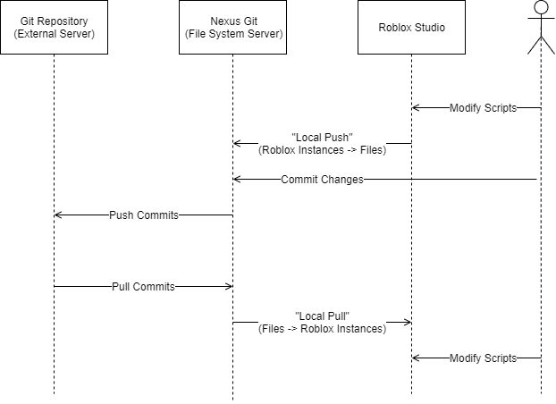

# Overview
The goal of Nexus Git is to provide functionality
with external-editor tools like Rojo for those who
use Roblox as their editor. Typically, external
editors are used to get the exclusive features
of external editors as well as to use Git repositories.
Being familiar with Git is assumed for the explaination
on using the plugin since this is not an overview
of Git, and there are lots of guides on how to get
started with Git. You should also get familiar with
it before purchasing the plugin.

Using Git in Roblox Studio on its own is difficult
because of the requirement to completely re-implement
the behavior of Git, ignoring the ability to have 
non-Roblox files and the ability to use features
like local branches. To get around this, Nexus Git
uses the file system that the server runs on and
provides visibility to Git in the file system.
Replicating files to and from the file system
is known as "local pushing" and "local pulling"
respectively.

